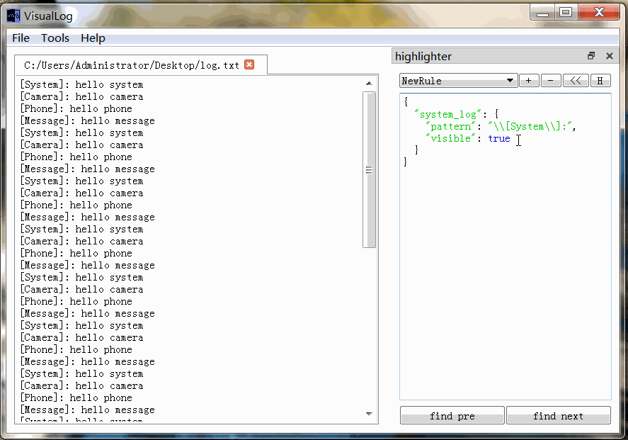
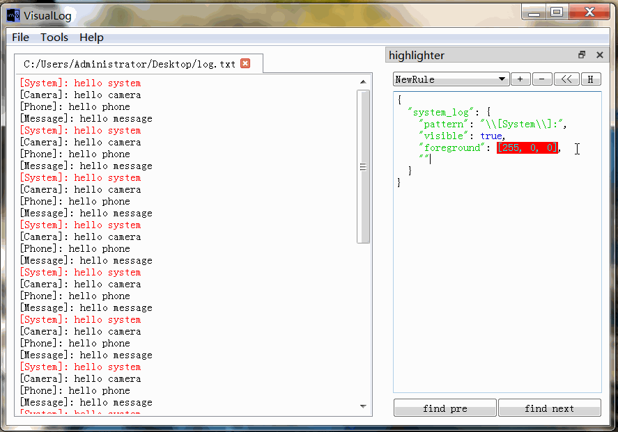
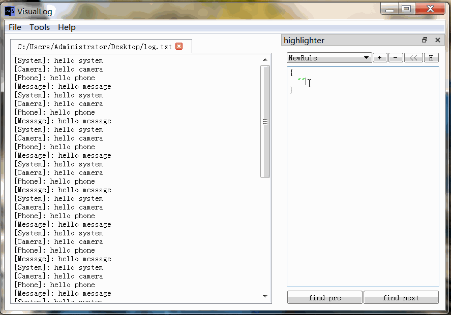
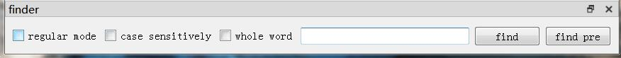

# VisualLog

log分析工具

## 功能

### 高亮器

通过json编辑log的显示规则，高亮感兴趣的log或者去除不感兴趣的log.

#### 语法：

```txt
{
	"log规则1": {
		"pattern": "正则表达式",
		"visible"： bool,
		"foreground": [r, g, b],
		"background": [r, g, b]
	},

	"log规则2": {
		"pattern": "正则表达式",
		"visible"： bool,
		"foreground": [r, g, b],
		"background": [r, g, b]
	}
}
```

#### 快捷键

功能 | 快捷键
-|-
显示或隐藏高亮器 | ctrl+h
高亮触发 | ctrl+enter

#### 举例

- 设置前景色



- 设置背景色



- 设置可见性



### 搜索器

这个功能很常见，不过多介绍了



#### 快捷键

功能 | 快捷键
-|-
显示或隐藏搜索器 | ctrl+f
